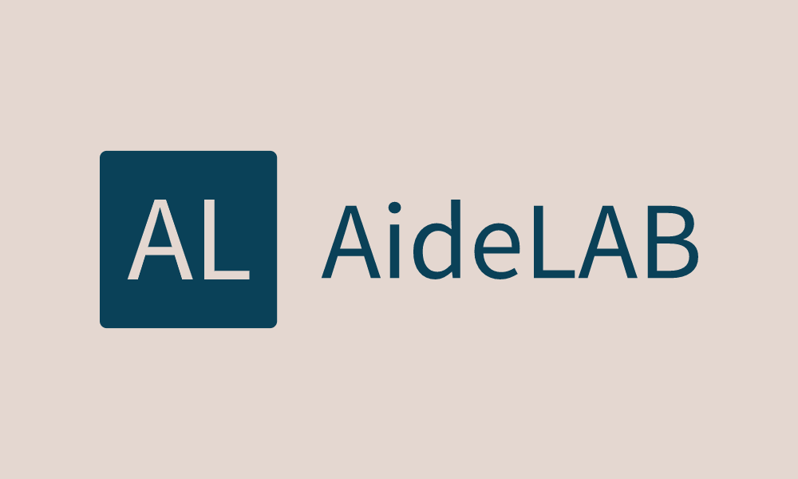

## About AideLAB

AideLAB adalah website yang menyediakan informasi mengenai jadwal dibukanya pendaftaran aslab, pemilihan aslab yang dilakukan oleh dosen pengampu, dan memudahkan aslab dalam memberi nilai kepada praktikan.

## Ways to clone
<ul>
    <li>Clone dari repository ini 
        <pre><code>$ git clone https://github.com/sitimaw/AideLAB.git</code></pre>
        ps: simpan di dalam folder htdocs
    </li>
    <li>Masuk ke dalam folder menggunakan cmd</li>
    <li>Jalankan composer install di cmd atau terminal</li>
    <li>Copy manual file .env</li>
    <li>Jalankan key generate 
        <pre><code>$ php artisan key:generate</code></pre>
    </li>
    <li>Buat database baru dengan nama 'aidelab' 
        <pre><code>$ mysql -u root</code></pre>
        <pre><code>$ create database aidelab</code></pre>
    </li>
    <li>Jalankan migration dan seed-nya 
        <pre><code>$ php artisan migrate --seed</code></pre>
    </li>
    <li>Jangan lupa require laravel ui 
        <pre><code>$ composer require laravel/ui</code></pre>
    </li>
    <li>Terakhir jalankan servernya 
        <pre><code>$ php artisan serve</code></pre>
    </li>
</ul>

## Developers
1. Siti Mawaddah <a>https://www.linkedin.com/in/sitimawaddah/</a>
2. Sulthan Zaidan Fauzi <a>https://www.linkedin.com/in/sulthanzaidanfauzi/</a>

## Copyright
<b>&copy; Copyright AideLAB (Juny 8th, 2021)</b>
